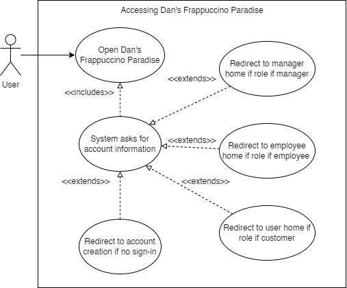
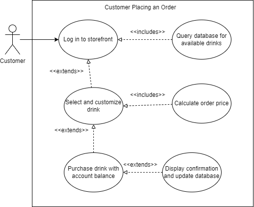
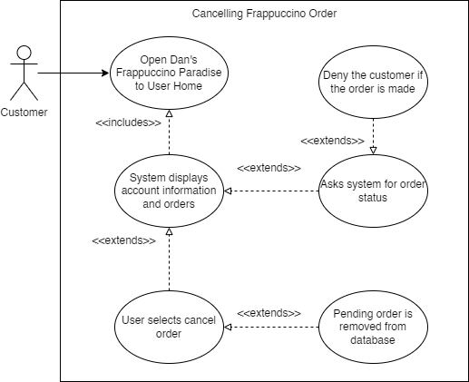
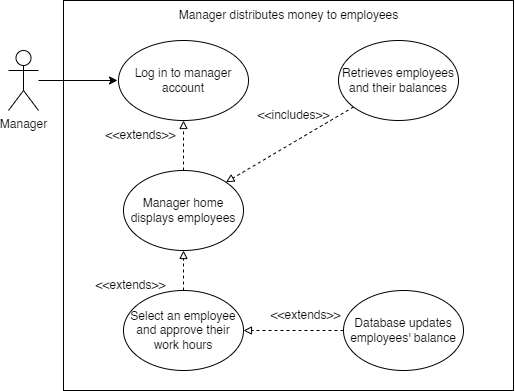
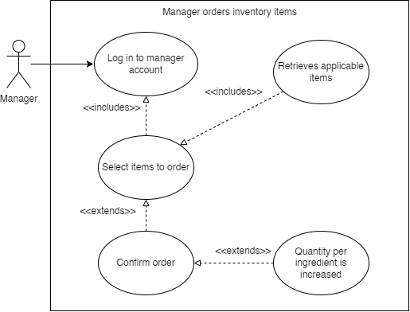
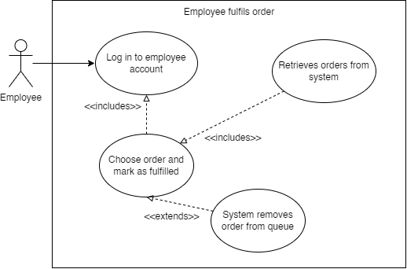
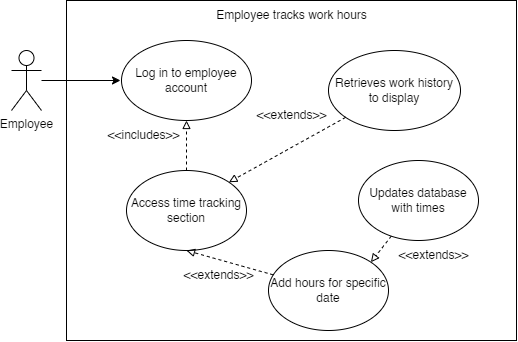

# Use Cases

__1\. Introduction and Context__

Dan has opened up a frappuccino restaurant and is in need of software to serve as a multi\-purpose management and sales system for all sales and store activity to go through\. This project aims to create a system to allow users of all roles to efficiently do what they need to do at the restaurant\.

Customers and Employees will be able to make orders from an assortment of customizable drinks\. When purchasing, customers will be able to pick them up with ease\. Similarly for employees, creating orders will add them to the queue for baristas to prepare\. They also have the ability to log their work hours within the same system\.

It will allow the manager/store owner to order inventory and keep track of items in stock, pricing, employees, store balance, and work hours\. They have the ability to create, edit, and remove employees that can be paid for their work time based on their flat rate of $15/hour\. 

By giving all users an easy way to get what they need out of Dan’s Frappuccino Paradise, the multi\-user software will help customers, employees, and managers alike in achieving a good frappuccino experience\.

__2\. Users and their Goals__

*Figure 1 \- User attempts access of the application*

Participating Actor: User 

Entry Condition:

- User wants to access Dan’s Frappuccino Paradise \(To order, view the menu, do employee tasks, manager tasks, or edit account information\.\)

Exit condition: 

- User has gained access
- User is rejected
- User no longer wants to use the app

Event flow: 

1. User opens the application
2. System requires a sign in
	1. Create an account
	2. Sign in 
3. Display role\-specific pages
	1. User home
	2. Employee home
	3. Manager home

*Figure 2 \- Customer creates account*

Participating actor: User

Entry Conditions:

- Customer wants to create an account

Exit Conditions: 

- Successful account creation
- Customer decides to not make an account

Event Flow: 

- User makes creation request
- System inquiries user information \(username, password, role\)
- Allow user into application with role\-based permissions 

*Figure 3 \- Customer places an order*

Participating actor: Customer

Entry Conditions:

- Customer wants to order a frappuccino 

Exit Conditions: 

- Successful order

Event Flow: 

- User logs in
- System displays drink options for them to customize
- Customer purchases a drink, depleting their balance and receiving confirmation 

*Figure 4 \- Customer cancels order*

Participating actor: Customer

Entry Conditions:

- Customer wants to cancel an order

Exit Conditions: 

- Successful cancellation 
- Denied cancellation 

Event Flow: 

- User logs in, accesses user home
- They select an order to cancel
- If it isn’t already finished, the order is removed from the system

*Figure 5 \- Manager distributes money*

Participating actor: Manager

Entry Conditions:

- Manager wants to pay employees for work hours

Exit Conditions: 

- Employee balance is increased

Event Flow: 

- Manger logs in 
- They select an employee
- Approve work hours and they are paid based on their wage

*Figure 6 \-  Manager orders items for inventory*

Participating actor: Manager

Entry Conditions:

- Manager needs to order items for store inventory

Exit Conditions: 

- Items are successfully “ordered” \(increase quantity in database\)

Event Flow: 

- Manger logs in 
- They select quantity of items
- Confirm order, values of QuantityOnHand per ProductIngredient increase\.

*Figure 7 \- Employee marks order as fulfilled*

Participating actor: Employee

Entry Conditions:

- Employee needs to tell the system an order is complete

Exit Conditions: 

- Order is marked as Fulfilled = true

Event Flow: 

- Employee logs in
- They locate and select the completed order
- Mark it as fulfilled, database changes to reflect 

*Figure 8 \- Employee tracks work hours*

Participating actor: Employee

Entry Conditions:

- Employee needs to record their labor hours

Exit Conditions: 

- Hours are added to system

Event Flow: 

- Employee logs in
- They add times for a date
- Increase HoursWorked in database
